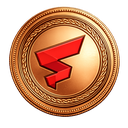
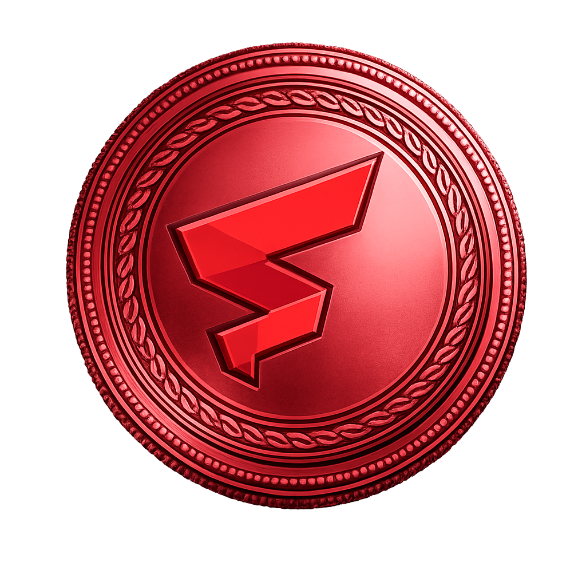
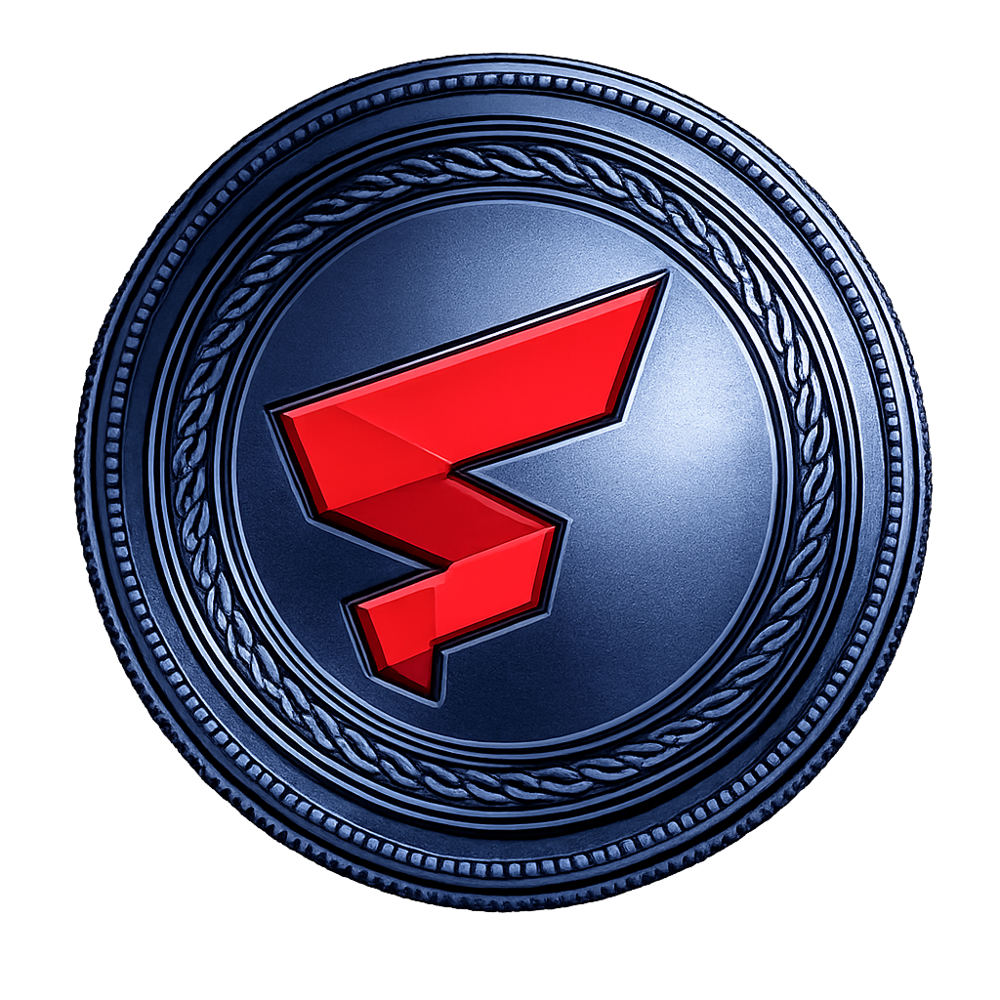

<p align="center">
  
</p>

<p align="center">
  A 2D idle coin collector built with <a href="https://godotengine.org/">Godot 4.6</a> and GDScript.<br>
  Catch falling coins, buy upgrades, and chase high combos.
</p>

<p align="center">
  <a href="https://d2mbkpxq9bew2t.cloudfront.net/"><strong>Play Now</strong></a>
</p>

---

## Coin Types

Coins unlock progressively as you upgrade **Coin Types** in the shop. Frenzy and Gold coins share the gold sprite but are distinguished by glow color and particle effects in-game:

| Coin | Sprite | Unlock | Value | Effect |
|------|--------|--------|-------|--------|
| **Copper** |  | Default | 1x | Always most common |
| **Silver** |  | Level 1 | 2x | Standard upgrade |
| **Frenzy** |  | Level 2 | — | Triggers 5s triple spawn rate |
| **Bomb** |  | Always | — | -10% coins, shrinks catcher 3s, resets combo |
| **Gold** |  | Level 3 | 5x | Falls 1.5x faster |
| **Multi** |  | Level 4 | — | Splits into 3 silver coins mid-air |

## Upgrades

| Upgrade | Effect | Base Cost | Scaling |
|---------|--------|-----------|---------|
| **Spawn Rate** | Spawn interval: 0.8s / 1.3^level (min 0.1s) | 25 | 1.50x |
| **Coin Value** | +1 coin value per level | 75 | 1.50x |
| **Catcher Speed** | 600 + 50 × level px/s | 15 | 1.20x |
| **Catcher Width** | 100 + 15 × level px | 30 | 1.25x |
| **Coin Types** | Unlocks new coin types (max level 4) | 100 | 2.50x |
| **Auto Platform** | +1 auto-catching platform per level | 750 | 1.60x |
| **Boost Power** | Dash distance: 200 + 50 × level px (3s cooldown) | 50 | 1.35x |

## Gameplay Features

### Combo System

Catching consecutive coins builds a combo counter that multiplies earnings:

- **50+ combo** — 1.5x multiplier
- **100+ combo** — 2.0x multiplier with rainbow text

Missing a coin or catching a bomb resets the combo to 0.

### Boost / Dash

Press **Space** to dash in your current movement direction. Distance scales with the Boost Power upgrade. 3-second cooldown between uses.

### Frenzy Mode

Catching a Frenzy coin triggers 5 seconds of triple spawn rate — maximize earnings with a wide catcher and high combo.

### Catcher Visual Tiers

The catcher evolves as you upgrade its width:

| Tier | Levels | Appearance |
|------|--------|------------|
| 0 | 0–9 | Blue |
| 1 | 10–19 | Wooden brown |
| 2 | 20–29 | Chrome silver |
| 3+ | 30+ | Rainbow animated |

## Controls

| Key | Action |
|-----|--------|
| Arrow keys / A / D | Move catcher |
| Space | Boost / dash |

## Building from Source

### Requirements

- [Godot 4.6](https://godotengine.org/download/) (standard build)

### Run Locally

1. Clone this repository
2. Open the project in Godot (`project.godot`)
3. Press **F5** to run

### Export for Web

```bash
mkdir -p build/web
godot --headless --export-release "Web" build/web/FlexCoins.html
```

## Tech Stack

- **Engine:** Godot 4.6 (Forward+ renderer)
- **Language:** GDScript
- **Architecture:** Composition-based scenes, autoload singleton for game state, signal-driven communication
- **Deployment:** SST on AWS (CloudFront + S3)

## License

MIT
